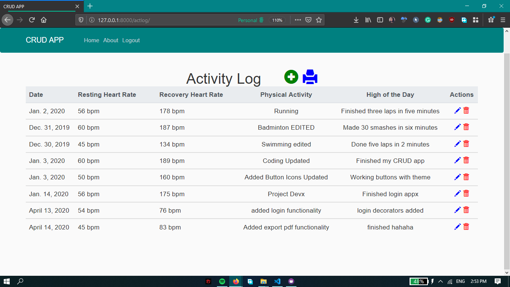

# django-crud-webapp-redKath
django-crud-webapp-redKath created by GitHub Classroom

### **CRUD Application**  (***Create, Read, Update and Delete***)

This is a fairly simple CRUD application with added features of:
- Login Authentication 
- Export to PDF option

The application is an activity log maker. 

Users are required to login before able to create an activity log.
